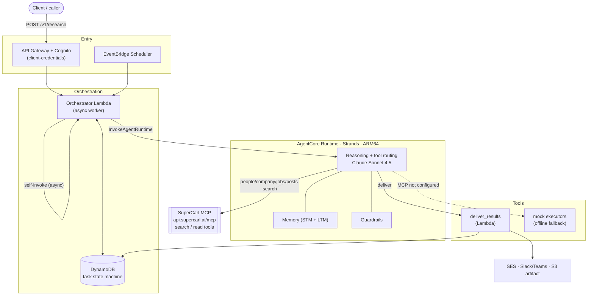
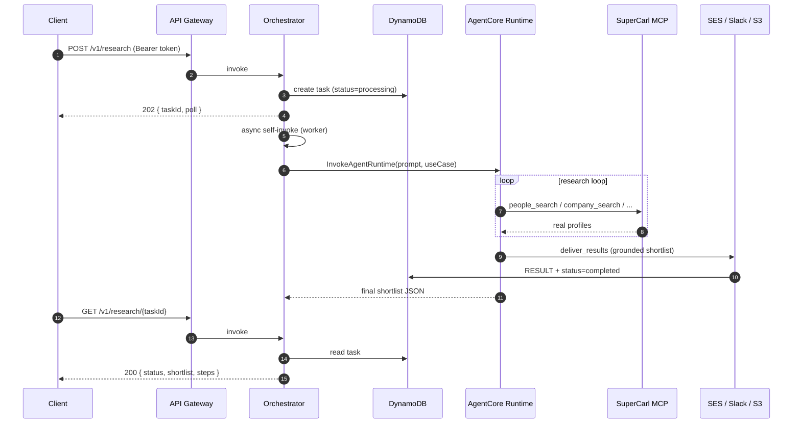

# SuperCarl

> An open-source, self-deployable **autonomous research worker on Amazon Bedrock AgentCore.**

Clone the repo, deploy it into **your own AWS account**, point it at your SuperCarl
account, and turn a single natural-language prompt into a synthesized shortlist of
real people / company profiles - delivered to email (SES), Slack/Teams, and S3.

This repository **is the product**: the reference implementation of the
"SuperCarl + AWS" blueprint, demonstrating the Agent-First integration inside a
live agentic loop. It is single-tenant per deployment - you run your own infra;
there is no shared backend.

> Built on the [Bedrock AgentCore QuickStart](https://github.com/awslabs/amazon-bedrock-agentcore-samples) pattern
> (Runtime + Memory + Guardrails + one-command CDK deploy), specialized for
> autonomous sourcing against the **live SuperCarl MCP server**.

### Two ways to run it - both fully self-serve

Everything here runs on **your own accounts**: your AWS account and your own
SuperCarl API key. Nothing is hosted or shared - clone, bring two credentials, run.
There are two ways to use it, and you can run either or both:

**A. In an open agent (OpenClaw / goose / Claude Code) - local, minutes.**
Connect the SuperCarl MCP and a model, then talk to it in plain language: search
people and companies, build a dashboard, schedule a watch, get results on WhatsApp.
The model is your choice - **Amazon Bedrock**, Anthropic, or a local Claude CLI.

```bash
export SUPERCARL_API_KEY=carl_...          # your SuperCarl key  (the data)
export OPENCLAW_MODEL=claude-opus-4-8      # your model          (or a Bedrock id)
./scripts/openclaw-up.sh                    # wires the MCP + model, ready to talk
```

Full walkthrough - signup, model on Bedrock, MCP, queries, scheduling, WhatsApp:
[docs/agent-frameworks/openclaw/end-to-end.md](docs/agent-frameworks/openclaw/end-to-end.md).
Also: [goose](docs/agent-frameworks/goose/), and [docs/mcp-integration.md](docs/mcp-integration.md)
for Claude Code / Codex / Cursor.

**B. As a deployed service on Amazon Bedrock AgentCore - in your AWS account.**
One command stands up the whole agent - Runtime, Memory, Guardrails, API, delivery,
scheduling - in **your** account, running the model on Bedrock. See
[Quick start](#quick-start) below.

Both paths are self-serve reference implementations: bring your own AWS account and
your own SuperCarl key, and you reproduce the same agent. Opening this repo in a
coding agent? [AGENTS.md](AGENTS.md) tells it how to set it up from zero.

---

## What it does

**Two trigger modes**
1. **On-demand** - submit a research task via API Gateway (Cognito-authed); the orchestrator runs the agent.
2. **Scheduled** - EventBridge fires a stored prompt on a schedule for set-and-forget sourcing.

**Two use cases**
1. **Recruiting** - one prompt yields a shortlist of 10+ relevant candidate profiles.
2. **Business Development** - a multi-step loop chaining Company Search → People Search.

**Output** - a structured shortlist (JSON) delivered to SES email and/or a
Slack/Teams webhook, with the raw artifact retained in S3. Every row is grounded
in and traceable to a SuperCarl tool result (`source = supercarl_api`).

---

## Architecture

Serverless, AWS-native, default region `us-east-1`. An **orchestrator Lambda** is
the hub: triggered on-demand (API Gateway + Cognito) or on a schedule
(EventBridge), it tracks state in **DynamoDB** and invokes the **AgentCore
Runtime** (Strands agent, ARM64). The agent connects to the **live SuperCarl MCP
server** for search/read tools and routes results out through our controlled
delivery channel.



> Editable diagram with **real AWS service icons**:
> [docs/diagrams/supercarl-architecture.drawio](docs/diagrams/supercarl-architecture.drawio)
> (open in [draw.io](https://app.diagrams.net) or the VS Code Draw.io extension).

### Request lifecycle (async)

`POST /v1/research` returns immediately with a `taskId`; the agent loop runs in a
background worker (API Gateway has a hard 29s timeout). Clients poll
`GET /v1/research/{taskId}`.



### Components

| Tier | Component | Role |
|------|-----------|------|
| Entry | API Gateway + Cognito | Authenticated REST task submission (client-credentials) |
| Entry | EventBridge Scheduler | On-demand + recurring research triggers |
| Orchestration | Orchestrator Lambda | Creates task, runs async worker, invokes Runtime, persists state |
| Orchestration | DynamoDB | Task-state machine (`META` / `STEP#n` / `RESULT`) |
| Agent | AgentCore Runtime | Strands agent (ARM64): reasoning + tool routing |
| Agent | Memory | STM (session loop) + LTM (deployer ICP) |
| Agent | Guardrails | Moderation, PII redaction, denied topics, prompt-attack defense |
| External | **SuperCarl MCP** | Live source of all profile data (search/read tools) |
| Tools | `deliver_results` Lambda | Channel-specific delivery + grounding + S3 retention |
| Delivery | SES + Slack/Teams + S3 | Formatted shortlist delivery + artifact |
| Storage | Secrets Manager | SuperCarl MCP creds; Slack webhook |
| Observability | CloudWatch / CloudTrail / OTEL | Dashboard, logs, traces, audit, alarms |

**Model.** `us.anthropic.claude-sonnet-4-5-20250929-v1:0` for multi-step reasoning
and tool routing; switchable to Sonnet 4.6 or Haiku 4.5 via the `MODEL_ID`
environment variable on the Runtime.

---

## Live SuperCarl integration (MCP)

The production SuperCarl API is an **MCP server** (`https://api.supercarl.ai/mcp`).
The agent connects to it over MCP (Streamable HTTP) using the key + URL stored in
Secrets Manager (`supercarl/api-key` as `{ "api_key": "...", "mcp_url": "..." }`),
and is given **only search/read tools**:

`people_search` · `people_lookup_batch` · `company_search` ·
`company_search_batch` · `jobs_search` · `posts_search` · `query_search_result`

> **Safety by design.** Write-capable MCP tools (`send_communication`,
> `project_action`, `contacts_*`, `watch_signals`, `super_carl_action`,
> `social_proximity_research`) are **excluded by an allowlist** so the agent can
> never send outreach or mutate the account. Delivery happens only through the
> controlled `deliver_results` channel.

If the MCP creds are absent, the agent falls back to mock executors so the stack
stays deployable and testable offline.

---

## Safety & grounding

- **Guardrails**: content filters (sexual, violence, hate, insults, misconduct,
  prompt attack), PII (email anonymized; SSN/credit-card blocked), denied topics
  (legal advice, financial advice, scoring beyond API data).
- **Grounding (hallucination mitigation)**: the system prompt forbids emitting
  any field not returned by a tool; a deterministic pass in `deliver_results`
  enforces `source = supercarl_api`, strips unknown fields, and drops
  identity-less rows before anything is sent.
- **Verify it live** (no model access needed): `AWS_PROFILE=<p> bash scripts/verify-guardrails.sh`.

---

## Prerequisites

**Two connections are required for it to work:**

1. **Amazon Bedrock** - the agent's LLM. Your AWS account must have **Bedrock
   model access enabled** for Claude (Sonnet 4.5 / 4.6 or Haiku 4.5) in your region.
2. **SuperCarl MCP** - the data source. You need a **SuperCarl API key**; the agent
   connects to `https://api.supercarl.ai/mcp`.

Without both, the research loop cannot run.

Also:
- AWS account + CLI configured
- Node.js 18+, Python 3.12+
- Docker (running - required for the Runtime ARM64 container build)
- AWS CDK v2

## Quick start

```bash
# 1. Deploy everything into your AWS account (one command)
./scripts/deploy.sh -p <your-aws-profile>

# 2. Point it at your SuperCarl account (MCP)
aws secretsmanager put-secret-value \
  --secret-id supercarl/api-key \
  --secret-string '{"api_key":"YOUR_SUPERCARL_KEY","mcp_url":"https://api.supercarl.ai/mcp"}' \
  --profile <your-aws-profile>

# 3. (optional) delivery + observability setup
AWS_PROFILE=<your-aws-profile> bash scripts/post-deploy.sh
```

Stack outputs (API URL, Cognito IDs, dashboard URL, …) are written to
`cdk-outputs.json`.

---

## Run it locally (no AWS)

Serve the same API on your machine - no AWS account, credentials, or GPU. Local
mode runs the same recruiting / BD routing with deterministic tool routing (no
Bedrock) against the mock SuperCarl data; use it for offline dev, tests, and demos.

```bash
./scripts/run-local.sh            # http://127.0.0.1:8080  (or: docker compose up)
curl -s -X POST localhost:8080/v1/research \
  -d '{"prompt":"Senior backend engineers in Austin","useCase":"recruiting"}' | jq
```

See [docs/local-development.md](docs/local-development.md).

## Click-through with Postman / Bruno

Exercise the API without writing code: use the
[Postman collection](docs/postman/SuperCarl.postman_collection.json) or the native
[Bruno collection](docs/bruno/) (*Open Collection* → `docs/bruno`), generate an
environment with `./scripts/make-postman-env.sh -p <profile>`, then run requests
1 → 2 → 3. Guides: [Postman](docs/postman/README.md) · [Bruno](docs/bruno/README.md).

---

## Testing it (UAT runbook)

Anyone with the deploy profile can exercise the system end to end.

```bash
# 0. Load outputs
API=$(jq -r '.SuperCarlStack.ApiUrl' cdk-outputs.json)
POOL=$(jq -r '.SuperCarlStack.UserPoolId' cdk-outputs.json)
CID=$(jq -r '.SuperCarlStack.UserPoolClientId' cdk-outputs.json)
DOMAIN=$(jq -r '.SuperCarlStack.CognitoDomain' cdk-outputs.json)
SECRET=$(aws cognito-idp describe-user-pool-client --user-pool-id "$POOL" \
  --client-id "$CID" --query 'UserPoolClient.ClientSecret' --output text --profile <p>)

# 1. Health (no auth)
curl -s "${API}health"          # {"status":"healthy","service":"supercarl"}

# 2. Get a Cognito token (client-credentials)
TOKEN=$(curl -s -X POST \
  "https://${DOMAIN}.auth.us-east-1.amazoncognito.com/oauth2/token" \
  -H "Content-Type: application/x-www-form-urlencoded" \
  -d "grant_type=client_credentials&client_id=${CID}&client_secret=${SECRET}&scope=supercarl-api/read supercarl-api/write" \
  | jq -r .access_token)

# 3. Submit a recruiting brief (returns immediately)
curl -s -X POST "${API}research" \
  -H "Authorization: Bearer ${TOKEN}" -H "Content-Type: application/json" \
  -d '{"prompt":"Senior backend engineers in Austin with AWS experience","useCase":"recruiting","channels":["ses"]}'
# -> { "taskId": "task-...", "status": "processing", "poll": "/v1/research/task-..." }

# 4. Poll until completed, then read the shortlist
curl -s "${API}research/<taskId>" -H "Authorization: Bearer ${TOKEN}" | jq '.status, .result'
```

**Expected result:** within ~1 minute the task reads `completed` with a shortlist
of real SuperCarl profiles (name, title, company, location, match_reason,
`source: supercarl_api`), plus a per-tool `STEP#n` trace. A BD brief
(`"useCase":"bd"`) exercises the Company → People loop.

Full request/response contract: [docs/api-contract.md](docs/api-contract.md).
Deep-dive walkthrough: [docs/deployment-guide.md](docs/deployment-guide.md).

---

## API

| Method | Endpoint | Description |
|--------|----------|-------------|
| POST | `/v1/research` | Submit a research task (async → `taskId`) |
| GET | `/v1/research/{taskId}` | Task status + synthesized shortlist + step trace |
| GET | `/v1/research` | List recent tasks |
| POST | `/v1/research/schedule` | Create a scheduled (EventBridge) task |
| GET | `/v1/health` | Health check (no auth) |

---

## Observability

- **Dashboard**: single CloudWatch dashboard (`supercarl`) across API Gateway,
  the orchestrator and executors, the AgentCore Runtime, Guardrails, and DynamoDB
  (see the `DashboardUrl` stack output).
- **Traces**: per-tool `STEP#n` items in DynamoDB (tool, status, latency, ts) +
  OTEL traces from the Runtime.
- **Audit**: CloudTrail → S3 + CloudWatch. **Alarms**: SNS topic `supercarl-alerts`.

---

## Tests

```bash
python3 tests/test_executors.py        # 22 - executors + grounding
python3 tests/test_orchestrator.py     # 14 - routing, validation, async worker
AWS_PROFILE=<p> bash scripts/verify-guardrails.sh   # 5 - guardrails, live
```

---

## Repository layout

```
agentcore_agents/      Strands SuperCarl agent (app.py, Dockerfile)
                       - live SuperCarl MCP tools (search/read) + deliver_results
                       - mock-executor fallback when MCP is not configured
functions/
  orchestrator/        Hub Lambda: API GW / EventBridge -> async worker -> Runtime,
                       DynamoDB state machine, EventBridge scheduling
  people_search/       Mock Action Group executor (offline fallback)
  profile_lookup/      Mock Action Group executor (offline fallback)
  company_search/      Mock Action Group executor (offline fallback)
  deliver_results/     Delivery executor (SES HTML + Slack blocks + S3, grounding)
infra/                 CDK app (single stack: lib/supercarl-stack.ts) + tests
local/                 Local dev API server (no AWS) + Dockerfile
mock/                  Mock SuperCarl API (OpenAPI + local server) for offline dev
scripts/               deploy.sh, post-deploy.sh, verify-guardrails.sh,
                       run-local.sh, openclaw-up.sh, make-postman-env.sh
tests/                 Executor + orchestrator unit tests
docs/                  architecture, API contract, scope, IAM, mcp-integration,
                       local-development, agent-frameworks/ (openclaw, goose),
                       diagrams/ (draw.io), postman/, bruno/
AGENTS.md / CLAUDE.md   Guide for coding agents (Claude Code, Codex, goose, …)
docker-compose.yml     Run the local API in a container
```

## Cleanup

```bash
cd infra && npx cdk destroy --profile <your-aws-profile>
```

## License

[Apache-2.0](LICENSE).
